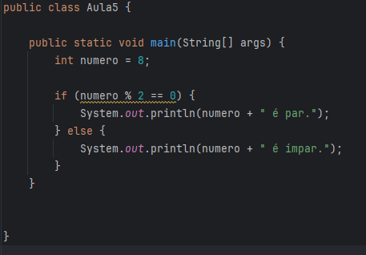
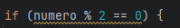

# Aula 5 - PARADGIMAS
## _Imperativo e Declarativo_ - Java

Antes de começarmos precisamos entender do que se trata os Paradigmas.

Paradigma é uma forma de pensar. É quando você pensa de uma forma já estabelecida, usando um padrão
já conhecido por você. 

Como assim?

>***Existem várias formas de pensar***

* Seja ela na área científica
* Seja ela na área religiosa
* Seja ela na ***programação***

Na programação, o modo _paradgimático_ de pensar está muito ligado na forma como um código deve ser escrito.
Antes de começarmos a escrever o código em si, já pensamos em como vamos estruturar cada parte dele. Logo,
todos os códigos possuem uma regra a sere seguida enquanto são escritos.

Até o momento, iremos falar sobre ***2 tipos de paradgimas*** encontrados dentro da programação.

## São eles:

>***Paradigma imperativo e Paragima declarativo***

### Paradgima imperativo:
É uma forma de escrita de código na qual, quando escrevemos, damos ordens ao computador com o fim
de atingir um determinado objetivo. Quando estamos escrevendo esse tipo de texto, o código
começa a funcionar através de comandos e instruções que dizem ao sistema, como passo a passo, de 
que forma aquela tarefa será realizada.

>No paradigma imperativo, o programador é que tem o total controle sobre o fluxo de execução
> do próprio código. Pois é ele quem padroniza a forma que o código será executado.

É aqui que o desenvolvedor usa estruras de controle como:

* Laços
* Condicionais
* E atribuições diretas (aquelas feitas dentro das variáveis) 

## Exemplo em Java - Verificando se um número é par

Aqui conseguimos notar que o desenvolvedor pensou em escrever o código dentro de uma main diretamente.
Logo após, o mesmo criou uma varíavel to tipo [***int***] com o nome [***número***] e deu um valor 8 para a 
variável.
>Aqui foi feita uma atribuição direta a varíavel, ***como falado anteiormente***.

Então o desenvolvedor usou de um laço de repetição para dizer que: se o número determinado anteriormente for par, então o que vai ser mostrado na tela será ***par***.
Se o número determinado anteriormente for ímpar, então o que vai ser mostrado na tela será ***ímpar***.

Notasse também que o método para saber se um número é ***ímpar*** ou ***par*** vem através dessa linha de código:

### Conclusão

Tudo nesse código está muito bem explícito sobre qual é o papel dele ao ser compilado.

